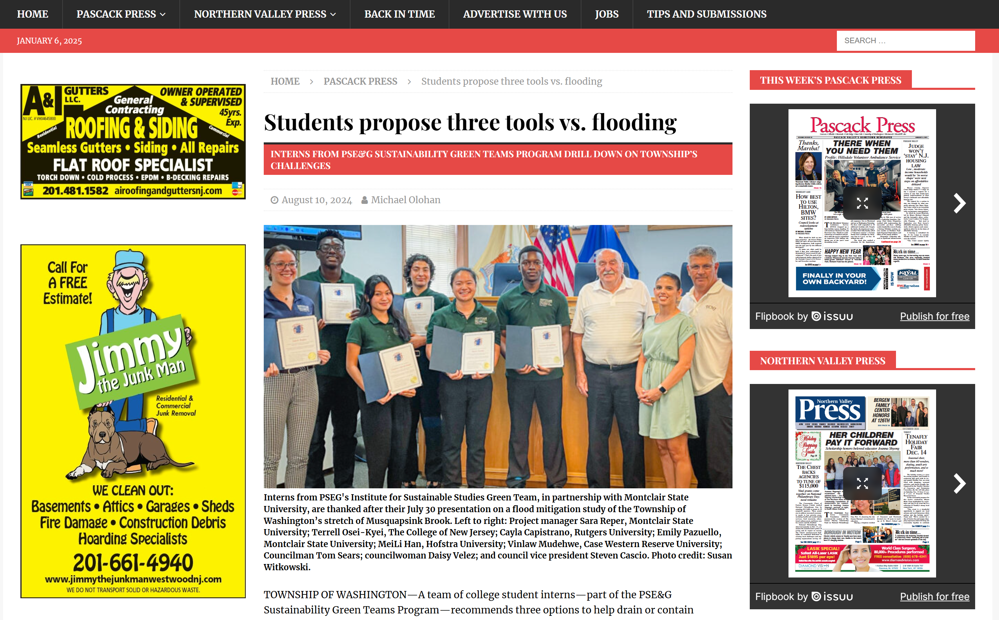
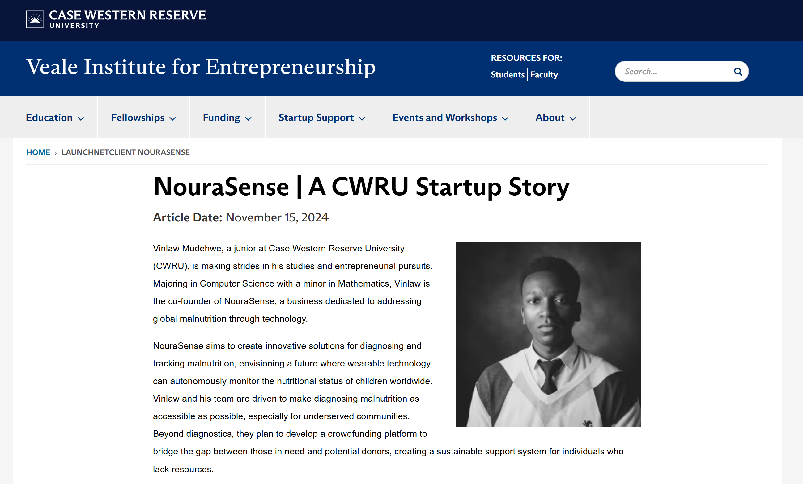

## Hi there 👋, I'm Vinlaw 

My name is Vinlaw, and I'm passionate about entrepreneurship, AI, and technology, with a drive to solve real-world problems and create meaningful impact. I also love exploring the power of writing as a creative exploration but also to share ideas and inspire change. You can check out my [LinkedIn](https://www.linkedin.com/in/vinlaw-mudehwe/). 

### 💻 Recent Projects I Have Worked On

**Face2Body** 😀➡️🧍‍♀️:
I developed a novel algorithm called Bounded Manhattan Assignment to map facial features to body landmarks. The algorithm is meant to be lightweight with both CPU and GPU compatibility. I came up with the idea while developing a zero-shot facial identification system called hippo-id 🦛 which is detailed below. The goal was to create an algorithm that creates a balance between efficiency for real-time inference as well as accuracy for practical applications. 

**Hippo-ID** 🦛:
I worked on a zero-shot engine for real-time facial recognition and identification at inference. The system uses Mediapipe, DeepFace, and ChromaDB for the core facial recognition and identification functionality. Additional modules such as Elevenlabs, Claude by Anthropic, and AssemblyAI are used for advanced text and audio interaction with the end user. The goal was to create a system that can learn and ask about people without explicit training like in most face detection and identification tasks using CNNs. The  architectural design of the system is also available on [Mermaid](https://www.mermaidchart.com/raw/c1571e97-ed20-4ef4-b6f1-48330a518a82?theme=light&version=v0.1&format=svg). 

**Malnutrition Diagnostics App** 🥗:
I built an app to diagnose malnutrition, profile nutrient requirements, plan optimal diets based on nutrient requirements, and generate medical reports. It combines anthropometric measurements, DRI recommendations, and local food data to offer practical insights. The system is developed for a startup that I cofounded whose mission is to use precision nutrition analytics to help parents and health professionals combat malnutrition, especially in underprivileged communities. More can be found on the official [NouraSense website](https://www.nourasense.com/).

### 🧑‍💻 Technologies I Use

 
My main area of technical interest is AI/ML engineering (SWE + AI). I like to leverage these technologies to solve practical problems. I also enjoy implementing some higher-level theoretical topics from my math classes into the projects I build. A recent implementation of this knowledge is an algorithm I developed called Bounded Manhattan Assignment for matching detected faces to their respective detected bodies using bounding boxes and pose landmarks. I am currently working on a technical report for the algorithm with the help of my college professor. 
 

 

  

### 🌟 Features

  
  

